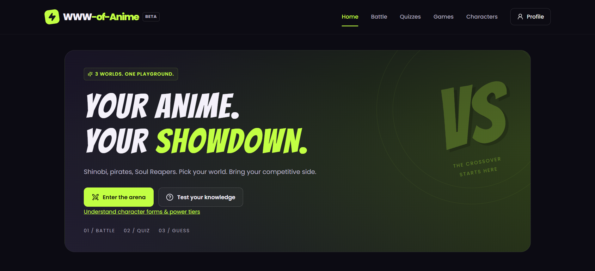
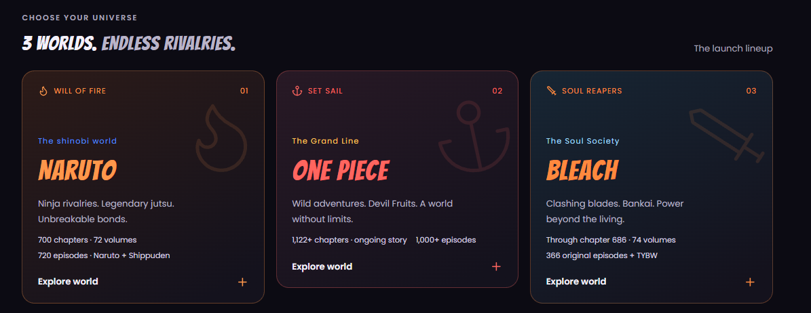
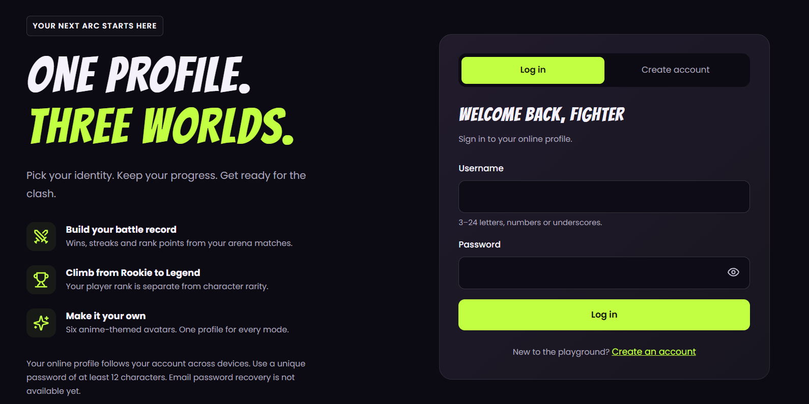
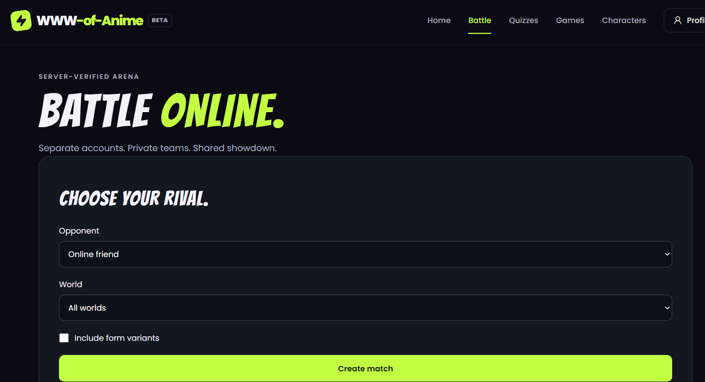
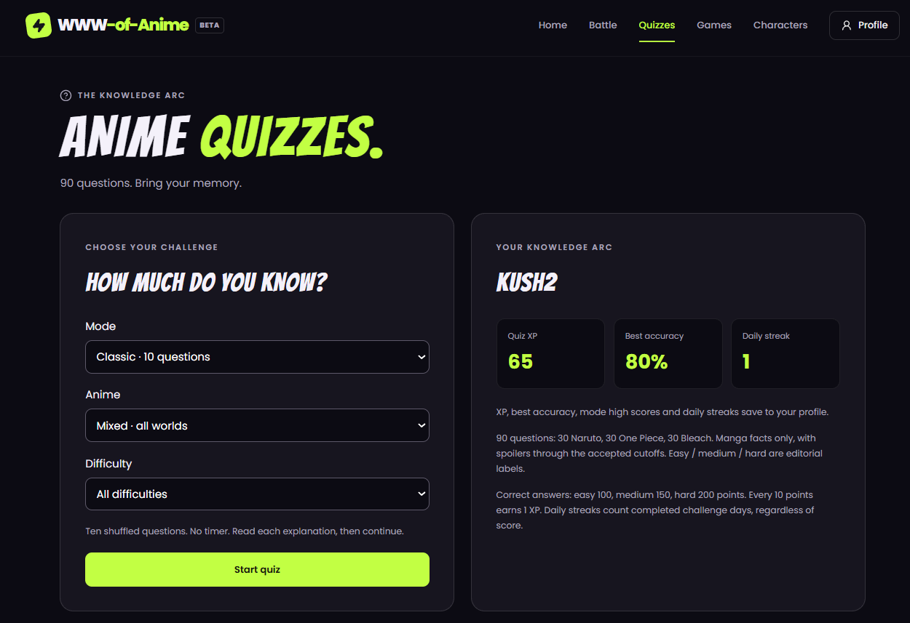
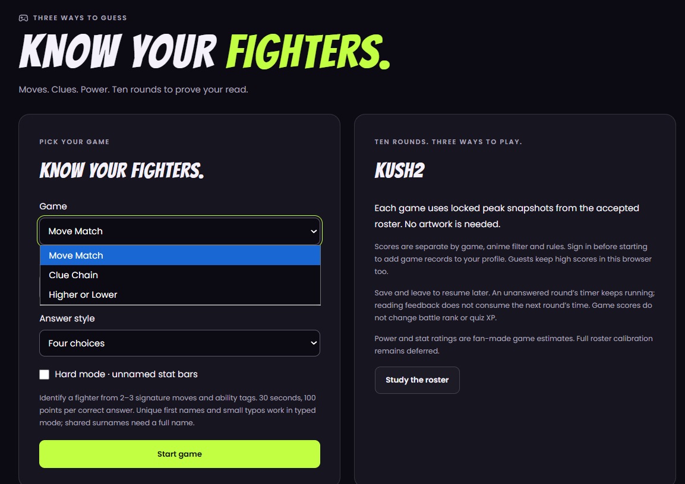
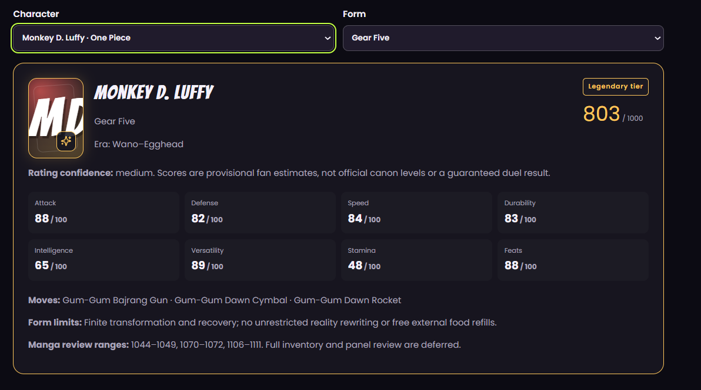
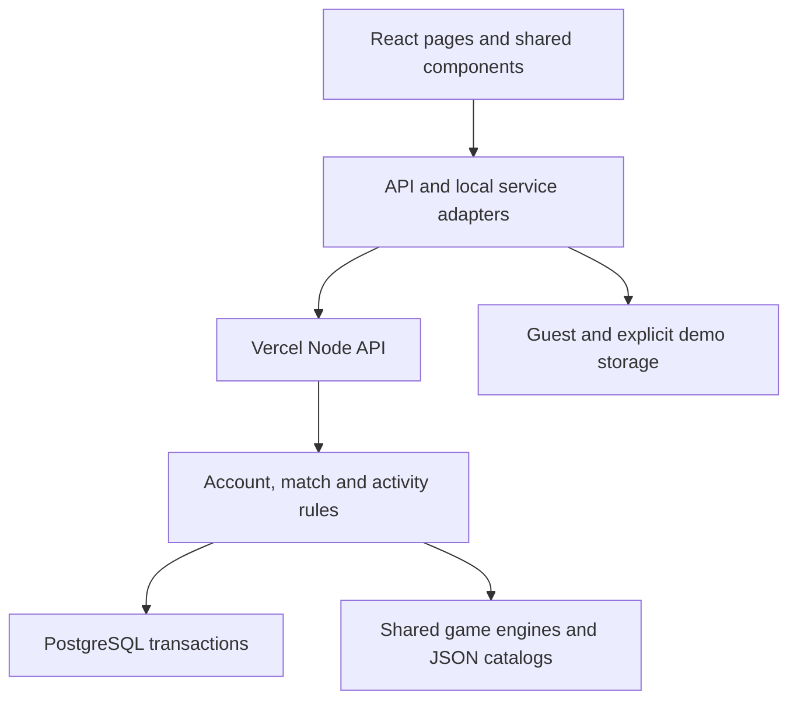

# WWW-of-Anime

**Three worlds. One playground.** An interactive fan project for Naruto, One Piece and Bleach, featuring character exploration, private online battles, quizzes and guessing games.

[Live demo](https://www-of-anime.vercel.app/) · [Architecture & interview guide](docs/architecture-interview-guide.md) · [Development](docs/development.md) · [Deployment](docs/deployment.md)

**Status: public beta.** Production uses Vercel Functions and PostgreSQL for online accounts and progress. An explicit browser-local demo mode remains available for development. Email password recovery and production operations work remain pending.



## Product walkthrough

The screenshots below were supplied by the project creator. They illustrate the interface, not automated proof that every workflow passes. Some captures show page sections rather than the entire viewport.

### Home — `/`

The landing page introduces the crossover experience and directs visitors to battles, quizzes and the character power guide. Shared navigation connects the major sections.

### Three anime worlds — `/` and `/anime/:animeId`

Naruto, One Piece and Bleach each have themed portal cards with introductory story and publication metadata. Selecting a world opens its introduction; the shared character explorer covers all three rosters. Publication counts are editorial snapshots and may need updating as ongoing series progress.



### Accounts — `/login` and `/signup`

Username/password authentication connects users to a persistent online profile. Account creation validates input; protected routes return signed-in users to their intended destination. Production uses server sessions in HttpOnly cookies, not browser-local credentials. Email recovery is not yet available.



### Battle Arena — `/battle`

Create a CPU match or invite a friend using a private link. Filter by world and optionally include form variants. Each participant drafts five fighters, uses an optional reroll, orders their lineup and locks it. The server checks account ownership, hides the opponent's lineup until completion, computes results and awards rank. Unfinished matches expire after 24 hours; visible tabs refresh match state every four seconds.



### Anime quizzes — `/quizzes`

A 90-question authored bank supports Classic, Timed Blitz and Daily Challenge modes. Anime/difficulty filters, answer explanations, XP, accuracy and streaks provide progression. Signed-in attempts and scoring are managed by the server; guest practice remains browser-local. Daily challenges reset at midnight India time.



### Guessing games — `/games`

Move Match, Clue Chain and Higher or Lower reuse the character roster. Options include multiple-choice or typed answers where supported, timed rounds, hints and resumable attempts. High scores are separate from battle rank and quiz XP.



### Characters and forms — `/characters`

Explore 120 identities across the three worlds and 237 authored form snapshots in the accepted scope. The form guide displays weighted stats, game power tiers, signature moves, limitations and editorial references. Forms are not complete canon inventories; ratings are provisional gameplay estimates.



### Profile — `/profile`

A protected profile combines an avatar, rank, battle record, quiz progress, game high scores and achievements. Online accounts persist across devices. Account security controls support password changes and revoking all sessions.

## Technology and architecture

| Layer | Implementation |
| --- | --- |
| Frontend | React 19, JavaScript, React Router 7 |
| Build and styling | Vite 6, Tailwind CSS 4, custom CSS |
| Animation and icons | Framer Motion, Lucide React |
| Backend | Node.js Vercel Functions, same-origin JSON API |
| Database | PostgreSQL via `pg`; production deployment uses Neon Free |
| Authentication | Salted scrypt passwords, hashed opaque sessions, HttpOnly cookies |
| Multiplayer | Server-owned state, private invites, row locks, revision checks and HTTP polling |
| Game rules | Shared pure JavaScript engines with seeded randomness and versioned replays |
| Quality checks | Node test runner, Vitest, Playwright, axe and JSON validators |
| Hosting | Vercel Hobby with a tracked SPA rewrite configuration |

This project uses **React + Vite, not Next.js**. Production authentication is not JWT-based. Character catalogs and questions are authored JSON; no external anime API or image downloader is required.



The browser manages presentation and input. The server verifies identity, permissions, transitions and official scores. Match/profile changes use transactions and locks; stale revisions return conflicts. The frontend refreshes latest state and carefully limits retries. See the [code walkthrough](docs/architecture-interview-guide.md) for request flows, important functions and tradeoffs.

## Run locally

Requires Node.js 22.12+; CI uses Node 24.

```bash
git clone https://github.com/kushagrapandey-cmd/WWW-of-Anime.git
cd WWW-of-Anime
npm ci
npm run dev
```

Open `http://localhost:5173`. Local development defaults to the browser-local prototype unless online mode is configured. Demo accounts do not automatically migrate to production. Do not use a valuable password for the local prototype.

For online development, configure `.env.local` using `.env.example`, provision PostgreSQL, set the documented origin/auth mode, and run migrations and the API in addition to Vite:

```bash
npm run db:migrate
npm run dev:api
```

Follow [deployment configuration](docs/deployment.md) for exact environment requirements. Never commit `.env.local` or expose database credentials in `VITE_*` variables. A static preview alone does not run the online API.

## Validation

```bash
npm run validate:data
npm test
npm run build
npx playwright install --with-deps chromium
npm run test:e2e
npm run test:e2e:online
```

CI runs data validation, authentication/server/unit tests, and prototype/online Chromium checks on pushes and pull requests. The online test harness uses PGlite for reproducible database tests. Test counts and results should be taken from the latest run rather than a fixed README claim. Broader browser/device and assistive-technology coverage remains ongoing work.

## Design choices and current limits

- CharacterAvatar provides initials, anime gradients, rarity framing and role icons; optional image loading failures retain the fallback. No third-party character artwork is bundled.
- Five-round battle outcomes combine authored power, bounded ability counters, team synergy and seeded luck. Game balance and canon accuracy are separate concerns.
- Turn-based multiplayer uses four-second polling rather than WebSockets. This simplifies serverless hosting but introduces update latency and request load.
- Online scores are server-calculated. Public authored question/roster data means this is not a cheat-proof competitive system.
- Optional sound is generated with Web Audio and starts only after opt-in. Reduced motion and keyboard navigation are supported.
- Email recovery, policy/account-deletion workflows, stronger operational monitoring/backups, further roster calibration and wider compatibility checks remain future work.
- The optional artwork pipeline is deferred; no `fetch-images` command exists.

## Development approach

This is an **AI-assisted project**. AI coding tools helped with implementation, documentation, debugging and test generation. The project creator defined the product direction and provided hands-on feedback. Specific authorship and review responsibility should be described accurately; AI-generated code still requires understanding, verification and maintenance.

## Documentation

- [Architecture, function walkthrough and interview preparation](docs/architecture-interview-guide.md)
- [Development structure](docs/development.md)
- [Deployment and environment configuration](docs/deployment.md)
- [Online upgrade](docs/online-upgrade.md)
- [Character forms policy](docs/character-forms.md)
- [Power rubric](docs/phase-2-power-rubric.md)
- [Expansion checklist](docs/expansion.md)
- [Task history](TASKS.md) and [state summary](STATE_SUMMARY.md)

## Fan-project notice

WWW-of-Anime is unofficial and is not affiliated with the rights holders of Naruto, One Piece or Bleach. Names and characters belong to their respective owners. Character stats and crossover outcomes are fan-made game mechanics. Future artwork requires appropriate usage rights. Content may contain spoilers.
