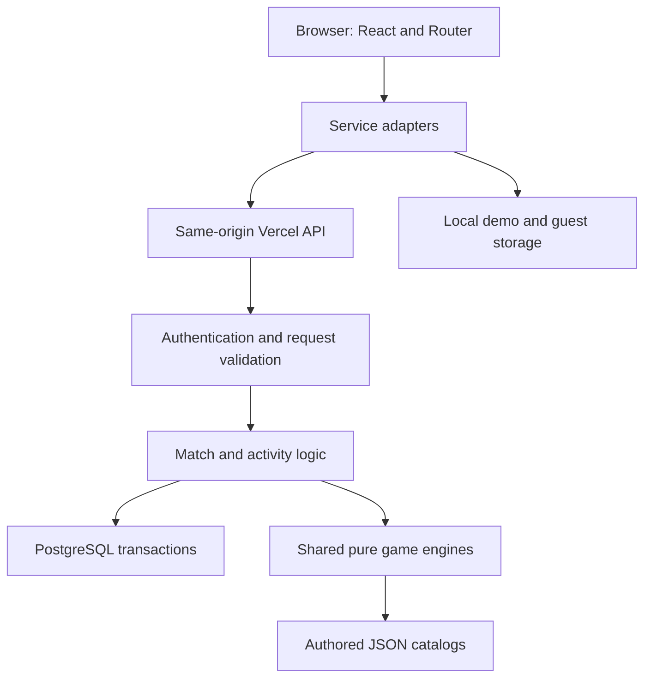
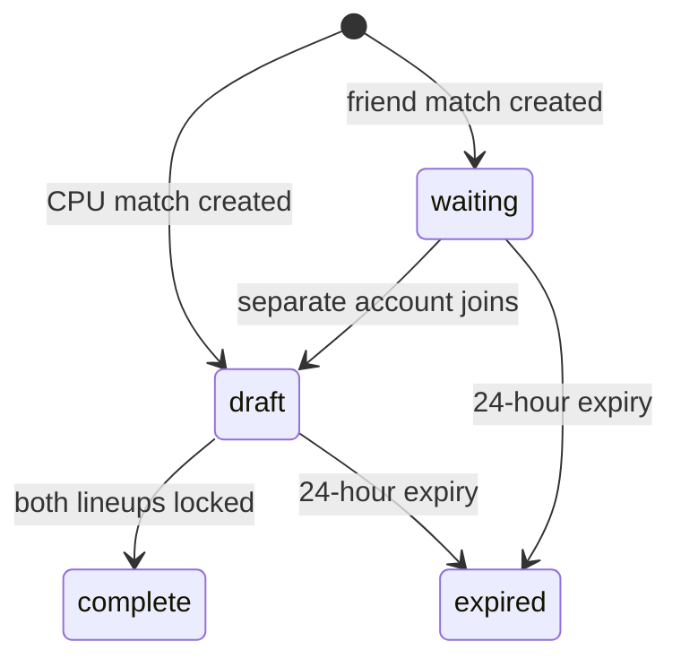

# WWW-of-Anime: architecture and interview guide

Source-verified against commit `2c3f5f4`. This describes implemented code, not a future design. Learning these explanations does not establish that you personally wrote or reviewed every implementation.

## 1. Accurate project description

WWW-of-Anime is a React 19 single-page application built with Vite. React Router handles navigation. Tailwind CSS 4 and custom CSS provide styling; Framer Motion provides animation; Lucide provides icons. Production uses Node.js Vercel Functions and PostgreSQL, deployed with Neon according to the deployment documentation. There is no Next.js, Express, MongoDB, Redux, Socket.IO or JWT implementation in the current production stack. Do not describe it as MERN or a Next.js application.

The product combines three anime worlds, a character/form explorer, five-fighter battles, private friend invitations, CPU matches, quizzes, daily challenges, guessing games, profiles and generated sound effects. Character content is authored JSON, not a live anime API. Scores are fan-made game estimates. Images are optional and default to CSS/initials avatars.

## 2. Architecture



The browser owns presentation, navigation, form input, loading indicators and local lineup ordering. The production server owns identity, private drafts, valid transitions, official results and persisted profile rewards. PostgreSQL is the durable source of truth. Local storage supports explicit demo mode, guest sessions and preferences; it is not the production authentication mechanism.

`src/main.jsx` mounts React with `createRoot`, `StrictMode`, `BrowserRouter`, `MotionConfig`, `SoundProvider` and `AuthProvider`. Provider placement makes account and sound state available throughout the app. StrictMode can repeat effect setup/cleanup in development to reveal lifecycle problems; it is not a production request-deduplication system.

`src/App.jsx` defines nested routes. `Layout` provides the navigation/footer and renders the matched child through `Outlet`. `ProtectedRoute` gates protected pages. This improves UX; actual security still requires server checks. `React.lazy(() => import(...))` splits non-home routes into downloaded chunks; `Suspense` in Layout supplies loading UI. `RouteErrorBoundary` handles rendering/chunk failures. A runtime API error still needs its own try/catch and visible error state.

## 3. Code map

| Location | Responsibility |
| --- | --- |
| `src/pages` | Page components, interaction and UI state |
| `src/components` | Reusable UI and battle views |
| `src/context/AuthContext.jsx` | Current account, loading/error state and account actions |
| `src/services` | API, local persistence and sound boundaries |
| `src/data` | Anime catalogs, characters, forms, quizzes and rating policy |
| `src/game` | Drafting, seeded randomness, battle simulation and ranking |
| `src/quiz` | Quiz attempt state, dates, scoring and profile updates |
| `src/minigames` | Guessing game sessions, validation and scoring |
| `api/index.js` | Vercel function entry point |
| `server/handler.js` | Request dispatch, authentication, limits and errors |
| `server/auth.js`, `server/security.js` | Sessions, passwords and security controls |
| `server/matches.js`, `server/matchEngine.js` | Persistence, permissions and match transitions |
| `server/activities.js` | Online quiz/mini-game attempts and rewards |
| `server/schema.sql`, `server/db.js` | Schema, pool and transaction wrapper |
| `tests`, `scripts`, `.github/workflows/ci.yml` | Automated tests, content validators and CI |

## 4. React and JavaScript features, with real examples

### State, effects, refs and context

`useState` drives forms, errors, current match, busy indicators and lineup order. Changing state schedules rendering; directly mutating an array does not provide a reliable React state update.

`useEffect` in `OnlineBattle.jsx` loads a URL-selected match and schedules polling. Cleanup stops obsolete polling and invalidates responses after route changes. Dependency arrays specify which changes should restart the effect.

`useRef` retains values across renders without triggering a render. `working.current` prevents overlapping actions immediately, before the busy state update renders. `current.current` holds the latest match for async operations. `generation.current` invalidates responses from older navigation/auth requests.

In `AuthContext.jsx`, `useCallback` keeps `refresh` stable. Each refresh gets a generation number. Its response only updates state if it is still the newest request:

```js
const version = ++generation.current;
const current = await AuthService.getCurrentUser();
if (version === generation.current) setUser(current);
```

This prevents a slow earlier request from overwriting newer state. Cleanup also increments the generation. This technique ignores stale responses; it does not necessarily cancel the network request itself.

`createContext` and the custom `useAuth` hook share account state without passing props through every intermediate component. The hook throws if used outside its provider. This is a context wrapper, not Redux.

### Services and adapters

Actual `src/services/AuthService.js`:

```js
export const AuthService = ONLINE
  ? new ApiAuthService()
  : new LocalAuthService();
```

This adapter boundary keeps UI callers similar across prototype and online modes. `src/config/online.js` defaults production to online unless the build explicitly requests demo mode. The flag is compile-time Vite configuration, not a runtime user toggle.

`ApiClient.js` builds `/api/index?route=...`, uses native `fetch`, JSON and `async/await`, sends same-origin credentials, disables caching and applies `AbortSignal.timeout(20000)`. GET parameters go in the URL; mutations use a JSON body. It checks HTTP status because `fetch` does not reject merely for a 400/500 response. Structured error status lets the battle page distinguish a 409 conflict from other failures.

### Core JavaScript patterns

- ES modules (`import`/`export`) separate UI, rules and services.
- Destructuring and default parameters normalize options.
- `map`, `filter`, `reduce` and `flat` transform roster/question data.
- `Set` checks unique identities and deduplicates achievements.
- `Map` counts shared anime/factions for synergy.
- `structuredClone` isolates nested draft/session state before updates.
- Optional chaining (`?.`) and nullish coalescing (`??`) handle absent values without conflating zero with missing data.
- Closures retain seeded RNG state and polling cancellation flags.
- `try/catch/finally` provides error handling and guaranteed database client release.
- `import.meta.glob` is Vite-specific build-time file discovery, not a standard JavaScript API.

Do not claim that useMemo/useReducer, React Server Components, Server Actions, Next.js middleware, SSR or ISR are used just because you know those terms.

## 5. Authentication: browser to database

1. The account form captures username/password and calls the AuthContext action.
2. ApiAuthService calls `api('auth/signup', data)` or login.
3. `createHandler` checks configuration, route/method, request origin, JSON type and size, then dispatches.
4. `credentials` validates a 3–24 character username and a 12–128 character signup password. The username is normalized to lowercase; PostgreSQL enforces uniqueness.
5. `hashPassword` uses Node's asynchronous scrypt with a random salt, cost N=32768 and a 64-byte derived key. The database stores an encoded hash, never the plaintext password.
6. Login recomputes the key and uses `timingSafeEqual`. Unknown usernames still perform password-derivation work and receive the same generic login error.
7. A cryptographically random 32-byte token becomes the session cookie. Only its SHA-256 digest is stored in `app_sessions`, with a seven-day expiry.
8. `currentUser` hashes the received cookie value and joins a valid session to its account profile.
9. Logout deletes the session and clears the cookie. Password change verifies the current password and revokes all sessions. The profile also supports signing out every session.

Production cookie: `__Host-aniclash`, `HttpOnly`, `Secure`, `SameSite=Lax`, `Path=/`, no Domain attribute. The legacy internal name survives the project rename. HttpOnly prevents normal browser JavaScript from reading the cookie; it does not make XSS harmless. Origin/content-type checks and rejection of cross-site fetches further protect mutation routes. SQL uses parameter placeholders rather than concatenating user input.

Database-backed limits survive function cold starts: signup/login per IP and normalized name, 240 authenticated requests/minute, 20 match creations/hour, and account security-operation limits. IP limit keys use HMAC rather than storing raw addresses as keys. Limits are abuse controls, not a complete bot defense.

## 6. Database design and transactions

| Table | Purpose |
| --- | --- |
| `app_users` | UUID, original and normalized username, password hash, profile JSONB |
| `app_sessions` | Hashed session token, account foreign key and expiry |
| `app_limits` | Shared rate-limit counters and reset timestamps |
| `app_matches` | Host/guest foreign keys, hashed invite, expiry and match JSONB |
| `app_activities` | Account-owned quiz/mini attempts, daily date and state JSONB |

Relational columns enforce identity, ownership, uniqueness and links. JSONB stores evolving nested game/profile structures. This is flexible, but whole-document updates require careful locking and would be less convenient for large analytics workloads than normalized score/event tables.

`getDatabase` creates a module-level `pg.Pool` with max 2 connections and reuses it within a warm function instance. `attachDatabasePool` integrates the pool with Vercel. The transaction wrapper acquires one client, runs BEGIN, commits on success, rolls back on failure, and always releases the client. A transaction must use that same client throughout.

`SELECT ... FOR UPDATE` makes competing transactions wait for the locked row. A transaction groups updates atomically; a lock prevents simultaneous read-modify-write races. These are distinct from client revision numbers.

## 7. Multiplayer: the most valuable interview topic

### Lifecycle



`newMatch` validates settings and initializes revision, names, kept/locked flags and a seeded draft. Creating a friend match returns a random invite token; only its hash is saved. Joining resolves that hash, rejects the host's own account, rejects a third account after acceptance, and checks expiry. A fresh host invite replaces the old hash, invalidating the old link.

### Why Player 1 cannot act as Player 2

Actual permission logic:

```js
export function matchPlayer(row, userId) {
  if (row.host_id === userId) return 0;
  if (row.guest_id === userId) return 1;
  fail(404, 'Match not found.');
}
```

The server derives the player from the authenticated session and stored participants. It does not trust a submitted player number. UI disabling alone would not stop a forged request.

`matchView` returns only your own team before completion; for the opponent it exposes count/locked status. It does not send the hidden opponent lineup and merely conceal it with CSS. Completed matches expose both teams and the result for replay.

### Conflict protection

Mutations lock the match row and compare the submitted revision with the stored revision:

```js
if (!Number.isInteger(data.revision) ||
    data.revision !== row.state.revision) {
  fail(409, 'The match changed. Refresh and try again.');
}
```

If two tabs submit revision 4, the first successful mutation advances to 5; the second is rejected. `OnlineBattle.action` fetches the latest state. It retries at most once only for selected draft actions when the player's own relevant draft state has not changed. It does not blindly repeat every request, avoiding accidental double draws or stale locks.

`changeMatch` rejects operations outside draft, alterations after locking, extra fighters, invalid rerolls and lineup orders that are not exactly the player's own five unique identities. Once both players lock, the server generates a battle seed and computes the outcome.

`award` locks participants in sorted order, updates profile rewards and stores completion in the same match transaction. The completed-stage guard prevents a repeated mutation from awarding the battle again. Ordered user locks reduce deadlock risk.

### Synchronization

This is HTTP polling, not WebSockets. The page polls after four-second delays while visible, skips polling during a mutation, and stops on completion/unmount. A recursive timeout schedules the next poll after work finishes, avoiding overlapping interval requests. The UI ignores older revisions. Tradeoff: simple serverless operation but several seconds of update latency and recurring database requests.

## 8. Draft and battle engine

`createDraft(seed)` initializes two teams, excluded identities, one reroll each and a draw index. `drawCard` gets a deterministic stream from `seed:drawIndex`, chooses a card and returns cloned state. Discarded identities stay excluded.

`pull` first selects a rarity tier with configured weights (35/30/20/11/4), then an identity, then a form. Choosing identity before form prevents characters with many forms getting multiplied draw odds within a tier. It does not imply globally identical odds across all identities/tiers. `draftCpu` fills its team, may reroll its weakest Common card, and shuffles the lineup.

`seededRandom` hashes a seed into integer state and returns a closure producing repeatable values; `shuffle` uses Fisher–Yates. This RNG is for deterministic gameplay, not secret tokens. Sessions/invites use Node crypto.

`simulateBattle` validates two five-fighter teams and resolves five corresponding pairs. Per-round effective power is:

```text
effectivePower = basePower × matchup × teamSynergy × luck
```

Ability counters cap at ±10%; a qualifying three-character anime/faction grouping adds 5%; luck ranges from 0.92 to 1.08. Equal effective power uses speed, then a seeded tiebreak. The engine records factors and explanations, counts round wins and selects an MVP by winning margin. Same snapshots + seed + supported version reproduce a replay.

`applyBattleResult` uses an Elo-style expectation:

```js
expected = 1 / (1 + 10 ** ((opponentPoints - yourPoints) / 400));
newPoints = Math.max(0, yourPoints + Math.round(32 * (actual - expected)));
```

Actual is 1 for a win and 0 for a loss. Player rank points are separate from character power/rarity. The rating system and randomness are design choices; do not claim canon accuracy or competitive balance proved by tests.

## 9. Catalog and character forms

`anime-catalog.json` provides worlds, themes and metadata. Vite's eager `import.meta.glob` discovers JSON banks at build time, while the server uses its own catalog loader. Adding supported content requires schema-valid JSON and validation/build; it does not fetch data dynamically from the internet.

There are 120 base identities and 237 authored form snapshots in the accepted scope. Base identity and form identity are separate: drafting can exclude a character regardless of form and lock a specific form's stats into a match.

`calculatePower` in `src/data/power.js` combines eight weighted stats: attack 25%, defense 10%, speed 15%, durability 12%, intelligence 8%, versatility 10%, stamina 10%, feats 10%. Its normalization maps the weighted stat scale onto a 1–1000 game score. Rarity tiers then use score ranges.

`CharacterAvatar` computes initials, applies anime CSS variables and rarity color, picks a Lucide role icon, and optionally renders a lazy-loaded image. `onError` remembers the failed source and keeps the fallback visible. This shared component makes future artwork adoption consistent without rewriting every page.

## 10. Quizzes and guessing games

`createAttempt` validates the bank, filters anime/difficulty, shuffles questions and answer options with stable seeds, and constructs cursor/answers/revision/deadline state. Shuffling options also remaps answerIndex. `answerAttempt` rejects duplicate answers, invalid choices and expired timers. `advanceAttempt` moves to the next question or finishes. `scoreAttempt` derives score from stored answers, difficulty and Blitz streak multipliers; XP is derived from score.

Daily questions use a shared date seed. `challengeDate` uses Intl.DateTimeFormat with the configured India timezone; the reset deadline uses +05:30. The partial unique index on account+daily_date enforces one stored daily attempt per account. An account row lock serializes attempt creation/profile updates across devices. Existing daily attempts are returned rather than creating a second one.

Mini-games use `createSession`, `answerRound`, `advanceRound`, `revealClue`, `scoreSession` and `applyMiniResult`. Modes reuse existing roster data. Server `activityRoute` validates ownership/revision, uses server time, calculates rewards and sets `saved` so repeated completion cannot award twice.

`activityView` removes unanswered quiz answerIndex/explanations and hides mini-game solutions/future rounds and seeds. This reduces direct response leakage. It does NOT create a cheat-proof trivia platform: the authored bank is public and guest play also needs data. Do not sell it as impossible to cheat.

## 11. Styling, performance and accessibility

Tailwind runs through the Vite plugin alongside custom page/component CSS. CSS gradients, comic typography, themed variables, grids and responsive rules create the visual identity; generated character images are not required.

Lazy routes reduce initial route code, but eager JSON imports still load banks with their importing chunks. Hashed `/assets` get immutable one-year caching; APIs send no-store. Code splitting does not eliminate cold-start or database wake-up latency.

Layout has skip navigation, route focus management and Suspense feedback. MotionConfig respects reduced-motion preferences. Forms and status/error messages use semantic controls and roles. Automated axe checks cover selected scenarios, not every possible assistive-technology experience.

SoundService uses Web Audio oscillators and gain ramps after user opt-in. A Set tracks live oscillators; generation guards stop stale playback after mute. Sound preferences use localStorage. No MP3 files or external audio service are required.

## 12. Deployment and testing

Local UI: `npm run dev`; local API: `npm run dev:api` with `.env.local`; PostgreSQL schema: `npm run db:migrate`. Vite's dev proxy forwards API calls. A plain static preview is not equivalent to the configured online production system.

Vercel builds the UI into `dist`; `api/index.js` delegates to the server handler. SPA rewrites return index.html for non-API paths so refreshing `/characters` works. Server environment holds DATABASE_URL, APP_ORIGIN and RATE_LIMIT_SECRET; never place database credentials in VITE_* variables, which can become browser-visible. The VITE_AUTH_MODE flag is intentionally public configuration.

CI installs dependencies on Node 24, runs Node authentication/server tests and Vitest game tests, validates catalogs/forms/quizzes, then runs Chromium Playwright prototype and online browser suites. The online test harness uses PGlite rather than the live Neon database. This makes repeatable database behavior testable but does not prove every production connection/deployment behavior. Check the latest CI run before quoting test counts or saying all tests pass.

## 13. How the project was created

The repository history supports this progression: UI scaffold/theme/navigation → authored roster/forms and power rubric → local accounts → pure draft/battle engine → quizzes/daily attempts → guessing games → polish/tests → PostgreSQL online accounts/matches/activities → auth and multiplayer hardening → Vercel deployment. The prototype-to-online service boundary explains why local implementations remain in the codebase.

This is an implementation progression, not proof of which lines the human personally authored. AI-assisted work included substantial implementation and testing assistance in the project conversations. Describe your own work precisely rather than adopting the generated code's entire authorship.

## 14. AI disclosure and interview ownership

Using AI is not the problem. Claiming independent expertise you cannot demonstrate is the problem. There is no universal reliable visual test that proves a website was made with AI. Generic visual patterns, verbose repetitive code, templated comments or unusual abstractions can raise suspicion but are not proof. Explicit generated-code markers, public conversations or commit/PR metadata can provide direct evidence. Do not claim that AI use is undetectable, and do not remove attribution to manufacture a false history.

Interviewers can test understanding by asking you to trace a request, change a feature, explain a transaction or diagnose a race. Memorizing this document will not replace reading and running the code.

A truthful framing based on this project's collaboration is: “I created WWW-of-Anime with substantial AI coding assistance. I defined the product scope, chose the anime experience, tested the site and raised issues such as multiplayer account separation. AI helped generate implementation, tests and deployment changes. I am working through the code so I can maintain it and explain its tradeoffs.” Only add “I reviewed the security implementation” or “I designed the transaction strategy” if you actually did that work.

You do not have to manually type every HTML element to own a product. Ownership means understanding the implementation, validating changes and maintaining the result. Name your responsibility accurately: product creator with AI-assisted development is different from independently authoring every subsystem.

### Questions you should be able to answer without this document

1. Why is this React/Vite rather than Next.js? It uses a client SPA and separate Node function API; current features do not require server-rendered React.
2. Why can Player 1 not impersonate Player 2? Server session identity maps to stored host/guest; payload player numbers are not authority.
3. Why use both row locks and revisions? Locks serialize database work; revisions reject stale client intentions.
4. Why not store production sessions in localStorage? HttpOnly cookies reduce token exposure to JavaScript; sessions remain revocable in the database.
5. Why hash a token with SHA-256 but a password with scrypt? Random tokens have high entropy; human passwords require deliberately expensive derivation.
6. Why polling? Simpler fit for turn-based serverless operation; latency and request load are the tradeoffs.
7. Can users award themselves rank? The online client adapter refuses direct rank updates; match completion computes awards on the server.
8. What prevents duplicate XP? Ownership/revision checks, account locks and the completion saved flag in one transaction.
9. Why deterministic RNG? Reproducible drafts/replays and tests; never use it for credentials.
10. What remains unfinished? Email recovery, stronger operational monitoring/backup procedures, policy/deletion workflows, wider browser verification, deeper content/balance review and optional artwork.

### Practical exercises before presenting yourself as the maintainer

- Trace signup from AuthPage to PostgreSQL and back; explain every trust boundary.
- Run a two-account match and inspect the API: the hidden opponent lineup should be absent before completion.
- Submit stale revisions from two sessions and observe the 409 behavior.
- Change one matchup counter, add a meaningful engine test and explain the resulting calculation.
- Add a schema-valid quiz question and run validators/tests.
- Explain the difference between an API timeout, auth failure and stale match conflict.
- Read the latest diff yourself and describe what it fixes without repeating its commit title.

These exercises are preparation suggestions; they are not claims that you have already completed them.
